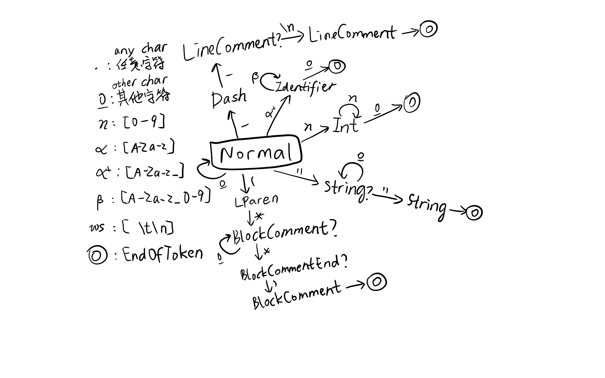
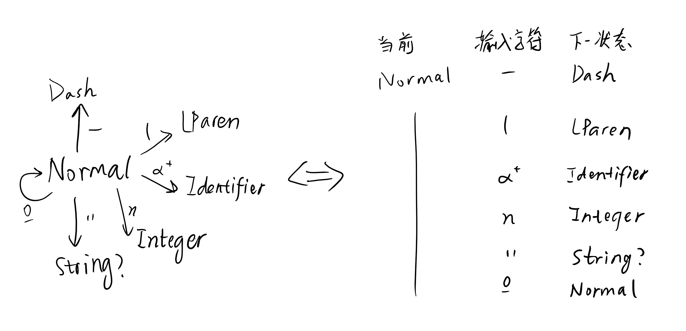

# 从零开始实现词法分析器


### 目录

---

[词法分析？要做啥呀？](#词法分析？要做啥呀？)

[为什么选择状态机描述](#为什么选择状态机描述)

[实现状态机](#实现状态机)

[将token记录下来](#将token记录下来)

[美化输出](#美化输出)

[改进](#改进)


## 词法分析？要做啥呀？

*以下是在介绍词法分析的同时引出要实现的东西，熟悉的可以跳过。有关实现模型的内容在之后会再次出现。*

首先让我们想一下，若要“人工”进行词法分析该怎么办。用以下的C程序段为例：
```C
#include <stdio.h>
int main()
{
    int girlfriend = 1;
    int you = 0;
    // When we decide things, my girlfriend always listens to me when we have the same idea. Or I'll always listen to her.
    printf("our agreement is %d\n", you == girlfriend ? you : girlfriend);
}
```
分析一下里面的元素。我们知道，词法分析（lexical analysis）是要分离出能够为语法分析提供参考的tokens（记号）。我们的原则是将具有单独功能的字符串归类成一个token。记住这个原则，可以开干了。

首先让我们看第一行。我们需要知道它是一个预编译声明，但注意我们仅仅通过这行的开头是个#获知这一点，而并不是因为后面的`<stdio.h>`。那么问题来了，究竟是把`#`当作一个token，还是`#include`整个？`#`在C语言中只在预编译指令中使用，把`#`单独视为token是可行的。但是C语言预编译指令不算很多，如果为了语法分析的快速识别，每一种指令单独视为一个token也没关系。这个原则在关键字识别依然有效，对于关键字很少的语言，我们可以一一将其视为独立的token。

那么我们采用视`#include`为整个token的方法。接下来，我们看到小于号。因为预编译指令是一个整体，看到小于号就表明直到之后的大于号之前的部分都是被包含的文件名。这样我们就得到这样一个token：`(STD_HEADER, "stdio.h")`。

没错，这就是我们将用来表示token的方法。这是一个**二元组`(token类型, token内容)`**，其中token类型就像英语的词性，token内容就像单词的拼写。对于Cool这样的语言，这样的二元组已经足够，但这并不是对于任意语言都适用的词法表示。

来到第二行，首先遇到了关键字`int`。对于*关键字*（keyword），我们希望最终产生`(KEYWORD, "int")`或`(KW_INT, "int")`这样的结果。如果将关键字单独作为一个个token，那么直接识别就好。但这里我们将采用将关键字视为一种特殊*标识符*（identifier）的方式，在识别出标识符后，再判断该标识符是不是关键字。这样的好处是可以减少许多状态（之后实现状态机的章节会讲到）。

这里需要再深入考虑词法分析器的结构。因为对于标识符，我们有一个“之后检查是否是关键字”的任务。这件事应该在取出一个token的同时进行，还是将词法分析分为两个步骤，第一步扫描出初步结果后，第二步进行关键字识别？第一种实现起来比较方便，看起来没有必要专门再重新扫描一遍分析关键字。但是实际上我们会选择第二种方法，因为第二步要做的不止是关键字识别。想想第一行的`#include <stdio.h>`。我们在扫描到`<stdio.h>`的时候其实并不知道它在`#include`后面。为什么？注意，词法分析器依赖一个**状态机**。这个状态机是NFA，它在完成`#include`的识别后就忘记了它，转而去识别下一个token。我们不应该给这个纯粹的NFA传入一个肮脏（dirty）的关于之前或之后有什么token的信息，因为这样写会使程序的逻辑变得异常复杂臃肿。实际上，词法分析器第一遍扫描只能得到`(PREP_INCLUDE, "#include"), (NAME, "<stdio.h>")`这样的东西。我们需要词法分析的第二步来确定后面的是一个要被包含的标准库头文件。

> 事实上，也可以直接识别整个`#include <...>`，但是这样之后还需要将里面的头文件名分离出来。如果不慎，我们甚至会弄出`(LT, "<"), (Identifier, "stdio"), (Dot, "."), (Identifier, "h"), (GT, ">")`这样的结果来，将`stdio`和`h`分别识别成了两个标识符，中间有个`.`表示结构体成员的引用，那可就糟糕了！

那好，我们已经决定要将关键字暂时先视为identifier。再往后是`main`，这是个函数名，显然属于identifier，而且可能会在词法分析的第二步被识别为更具体的function name。然后是一对括号（parenthesis, *pl.* parentheses）。对于括号和其他界符（定界符，分隔单词或标记语法单元的开始和结束），应当一一对应不同的token。下一行的大括号（brace）也同样。在接下来是类似于`int main`的情况，`int`先视为identifier，`girlfriend`是变量名，属于identifier。之后遇到`=`。我们可以将`=`与`+=` `-=` `*=` `/=`之类的符号统一为“赋值符号（assignment symbol）”这个类别，也可以分别开。再然后是`1`，这是个整型常量（integer constant）。然后是分号（semicolon），这是语句结束符，属于界符。

下一行`int you = 0`与上一行类似，略过。然后是一个令人感兴趣的东西：行注释（line-comment）。一个行注释以`//`开始，换行符`'\n'`结束。它之所以让人感兴趣是因为它不像identifier结束的标志是遇到除英文字母、数字和下划线以外的字符，行注释判断结束只需要遇到换行即可。

再下一行是`printf`，属于identifier，然后是`(`。然后是又一个令人感兴趣的东西：字符串常量(string constant)，它以`"`开始，`"`结束。然后是一个三目表达式，我们会依次识别出标识符`you`，比较运算符`==`，标识符`girlfriend`，运算符`?`，再次出现的标识符`you`，运算符`:`，标识符`girlfriend`，最后`;`。最后一行识别出`}`，到达文件结束符（EOF）。

这样第一步分析结束，第二步分析将根据token的内容和先后关系进一步确定其类别。这其实是在减轻语法分析器的任务。


### 词汇

- 词法分析`lexical analysis`：采用特定的规则分析一段文字中的词语的所属的类别。
- 词法分析器`lexer`：吃进一段代码，吐出token的列表的函数。
- 字符`character`：词法分析的基本单元。
- 标记`token`：词法分析产出物的基本单元，包含一个词语的类别和内容。
- 标识符`identifier`：一个以字母或下划线开头，后接零个或多个字母、数字或下划线的单词。用正则表达式可表述为`^[A-Za-z_]([A-Za-z_]*)$`。
- 运算符`operator`：一个接受若干个操作数`operand`为参数，并至少返回一个值的函数。
- 状态机`state machine`：一个具有若干个状态，若干个符号，并且可根据当前状态和符号决定下一个状态的自动机。


回顾以上我们做的事情，我们能发现一个似乎被忽略了的细节。我们以什么为基准分隔词语？其实以上的分析直接用做算法还有很多困难。这些都将在之后的实践中出现，并获得答案。


## 为什么选择状态机描述

[TOP⇧](#从零开始实现词法分析器)



【图1】


上图就是一个能够解析一部分Cool语言词法的状态机。这十分相似于DFA。这个状态机能解析和区分Cool语言的标识符(identifier)、`Int`型常量、`String`型常量、行注释(line-comment)和块注释(block-comment)。图中每一个单词首字母大写的都是状态的名字，包括`EndOfToken`这个表示token结束的状态。解析任何一个词之前，状态机都处于`Normal`状态，到达`EndOfToken`状态时，便会产生一个token，之后状态便回到`Normal`。如果你熟悉自动机理论，这张图你应该很快就能看懂。如果不熟悉，你可能需要补习一下，因为这里我不会详细介绍。

箭头上面就是状态机读入的下一个字符。比如当前状态是`Normal`，读入一个`(`会使状态转移到`LParen`（左圆括号）。此时再读入一个`*`会使状态转移到`BlockComment?`（块注释）。之所以要加一个`?`，是为了将`BlockComment`这个名字留给token识别完成前的最后一个，好方便输出token的时候告诉用户这个token的类型。再举一例，当前状态是`Int`时，若读入一个*`n`*（数字），下一个状态仍是`Int`。若读入除数字外的其他字符，则转移到`EndOfToken`。注意，<u>o</u> 其他这个转移符号代表从**所有字符**中剔除这个状态**所有出发箭头**上的字母后剩下的字符中的任意字符。对于`Int`状态，此即`[^[0-9]]`。

可以看到，状态机描述可以清晰地展示词法分析的过程和步骤，而且不会遇到歧义的情形。词法分析器的蓝图已经在我们的脑海中展开。单字符状态机的最大缺点即是对于繁杂的词法，需要大量的状态来实现。这个时候就必须使用相对复杂、必须处理重复情形的正则表达式字母法，或者自动生成状态机。


## 实现状态机

[TOP⇧](#从零开始实现词法分析器)

接下来我们将用Python实现Cool语言的词法分析器。

形式化地说，状态机是由状态集（包含了所有状态）、字母表（状态和状态之间的箭头上的符号们）、状态转移表（描述什么状态经过带有什么字母的箭头会转移到什么状态）构成的。那么实现状态机实际上是要解决状态转移表的描述和查表手段。


对于状态转移表（transfer diagram，简称转移表）的直观印象：

| 状态       | 箭头         | 结果状态    |
| ---------- | ------------ | ----------- |
| Normal     | -            | Dash        |
| Normal     | [A-Za-z_]    | Identifier  |
| Normal     | (others)     | Normal      |
| Dash       | -            | LineComment |
| Dash       | (others)     | Normal      |
| Identifier | [A-Za-z_0-9] | Identifier  |
| Identifier | (others)     | Normal      |

上面的转移表表示的是图1的一小部分。描述了`Normal`、`Dash`、`Identifier`状态接受不同的字符将会导向哪一个状态。转移表应该这样读：例如第一行，当状态机处于`Normal`状态时，若接受一个破折号`-`的输入，状态机将迁移到`Dash`状态。转移表实质上是状态转移图的一个易于用文本表示和用格式化数据存储的等价形式。


看着转移表，我们对于表示它已经有了大体的思路：表示出状态，和表示出箭头，然后用一个迭代器（元组、列表、字典等）把它们装在一起。

首先是状态的表示。便于代码的编写，最好表示形式能够直观地体现状态的含义，还要便于检索。在C/C++中我们会想到用`enum`或`enum class`，但是在Python中我们完全可以直接使用字符串。如果用`dict`存储整个转移表，就可以以接近$O(1)$的时间复杂度查询到对应项。这也省去了之后要添加状态需要同时修改状态表和转移表的麻烦（不过为了给其他人一个总览，令在注释中列出所有状态也可以）。

再然后是箭头的表示。由于箭头意味着读入有且只有一个字符，所以我们可以就把箭头表示成那个字符。但这么做的问题是对于`[A-Za-z_0-9]`这样的规则我们得写26+26+1+10=63条几乎完全一样的规则。另一种方法是用包含所有导向相同结果的字符串，这样是可以的，但在这里我们用一种更加优雅而实用的方法。这种方法常常被JavaScript程序员用来替代大量的if-else语句树，它就是**表查找法**。

对于`[A-Za-z_0-9]`这样的规则，其实用if判断是最轻松的，否则可能要写成类似于`alphanum_ = "ABCDEFGHIJKLMNOPQRSTUVWXYZabcdefghijklmnopqrstuvwxyz_0123456789"`或`ord(c) in list(range(48, 58)) + list(range(65, 91)) + list(range(97, 123))`这样的东西，十分难看。但if判断不能直接作为一个值，所以要使用函数。由于我们既需要`[A-Za-z_]`也需要`[0-9]`，所以可以分别为这两个写函数，再合成。

所以最终确定了，转移表的每一个`状态-箭头-状态`组合应该是`str-function-str`。我们可以直接用三元组来表示它，并用这种三元组的列表来表示整个转移表。但为了查表的方便，最好将同一出发状态的转移合并起来。因为我们手动查表时，通常都是先找到第一列是当前状态的行，再从这些行中找第二列是输入字符的行。所以转移表可以表示为`状态-所有[从该状态出发的箭头-对应的结果状态]`，如下图所示



【图2】

上图对应了`Normal`状态所有可能的转移情况，这样的一个东西称作**转移项目**`state_trans_item`。转移表就是由所有带有出发箭头的状态的转移项目构成的。


所以最后，转移表应该是这样的一个数据结构：

```Python
# 使用 C++ 风格的类型声明。Python 不需要类型声明，写出来是为了便于理解
# typedef Arrow function<str, bool>
#     箭头 是一个接受一个字符（长度为1的字符串。我们只能在程序里做限制来保证这一点），返回一个布尔值的函数
#     例如 下面这个返回输入字符是否是数字字符的函数
#          def is_number(c):
#              return '0' <= c <= '9'
# typedef Matching [Arrow, str]
#     匹配 是一个长度为2的列表。第一个元素是箭头，第二个是结果状态
#          使用列表而不是元组是考虑到以后可能用 JSON 储存状态表的方便。Python 的 JSON API 默认只产生列表和字典
#     例如 Normal 状态有一个 [is_number, "Integer"] 的匹配
# typedef StateTrans dict<str, [Matching]>
#     转移表 是出发状态-匹配的列表的字典。每一个字典项即是一个转移项目
state_trans = {
    "Number": [
        [is_number, "Integer"],
        [is_id_head, "Identifier"],
        [lambda x: x == '-', "Dash"],
        [lambda x: x == '(', "LParen"],
        [lambda x: x == '"', "String?"],
        # TODO: 继续补充
        [otherwise, "Normal"]
    ],
    # TODO: 补充完整
    "Error": [
        [otherwise, "Error"]
    ]
}

# 用到的函数
def is_number(c):
    """是数字([0-9])"""
    return '0' <= c <= '9'

def is_id_head(c):
    """是标识符开头([A-Za-z_])"""
    return 'A' <= c <= 'Z' or 'a' <= c <= 'z' or c == '_'

def otherwise(c):
    """永远返回True，在所有其他匹配的最后作为万能匹配"""
    return True

```

这就是表查找法的写法。注意到我们使用单独定义的函数来检测输入字符是数字还是标识符，而用lambda表达式来检测特殊的字符。lambda表达式是函数定义的匿名形式。在这里如果写`x == '-'`就可能导致一个Traceback，告诉你`x`这个名字没有声明就被使用。即使已定义`x`这个全局变量，`x == '-'`实际上代表一个`bool`值，而这个布尔值只与`x`的值有关系。你当然可以通过修改`x`来达到目的，但我们需要保证表中的这一项和`is_number`、`is_id_head`一样是可调用的，也就是它们也得是函数。所以我们要用lambda表达式，让它接受一个参数`x`，并返回是否与后面的字符相等的布尔值。`lambda x: x == '"'`等价于先定义函数`def _(x): x == '"'`，再在需要的位置写上函数名`_`。

注意上面的函数`otherwise`起到类似于if-else串的`else`，或C/C++ switch-case语句的`default`的作用。如果你熟悉Haskell那你肯定早已会心一笑。它就是简单地返回`True`。只要我们写的查表算法是从上往下逐个尝试，那`otherwise`就会在其他都失败之后起作用。

好，既然提到了查表算法，那我们就开始着手写状态转移函数吧。显然，转移函数接受一个状态和一个输入字符，返回一个结果状态，即`update_state(state: str, c: str): str`。它应该是如下的样子：

```Python
def update_state(state, c):
    global state_trans # 引入前面定义的转移表全局变量
    
    guard = state_trans[state] # 用dict的语法找到当前状态对应的所有Matching的列表
    
    for item in guard: # 这可以保证检查顺序是从上到下的
        if item[0](x): # 别忘了 item 是一个 Matching。它的第一个元素是判断一个字符是否满足条件的函数，我们用输入字符调用它
            return item[1] # 返回新状态

```

很短吧！没错，表查找的数据结构可以保证高效的条件匹配，而且数据和算法分离，既方便之后添加新项，看起来也比大规模的if-else树清晰得多。想想不这么写的后果：

```Python
def update_state(state, c):
    if state == "Normal":
        if is_number(c):
            return "Integer"
        elif c == '-':
            return "Dash"
        # 一大串 elif
        else:
            return "Normal"
    # 再来一大串 elif

```

不过这也比不使用状态机而是正则表达式模型要扁平得多。


好了，状态机至此为止已经完美实现。我们终于可以开始按照先前的设计好转移图完善我们的转移表了。完整代码见[lexer.py](../lexer.py)。


## 将token记录下来

[TOP⇧](#从零开始实现词法分析器)

